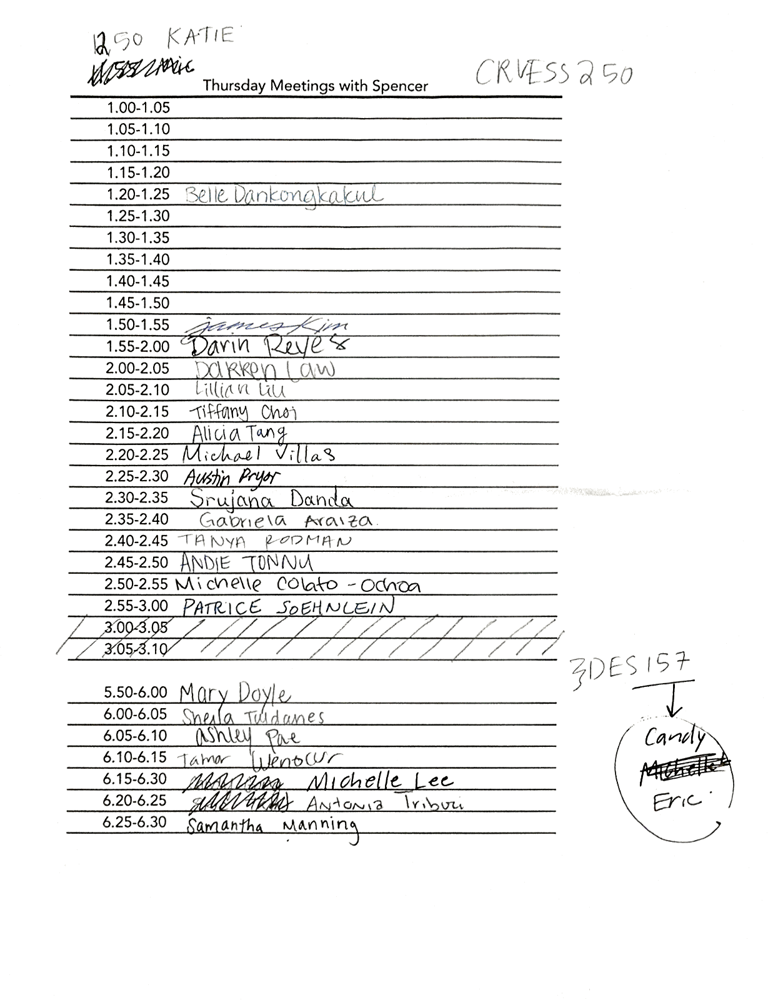

Interactive Grading
===================

Starting on January 14th we will meet individually for 5 minutes. Please come prepared to demo and discuss your code.

Follow these [instructions](GitHubPages) to create a repo named `ex1` to host your portal site. Then please edit [this](Accounts) Wiki page to link to it.

#### Schedule

